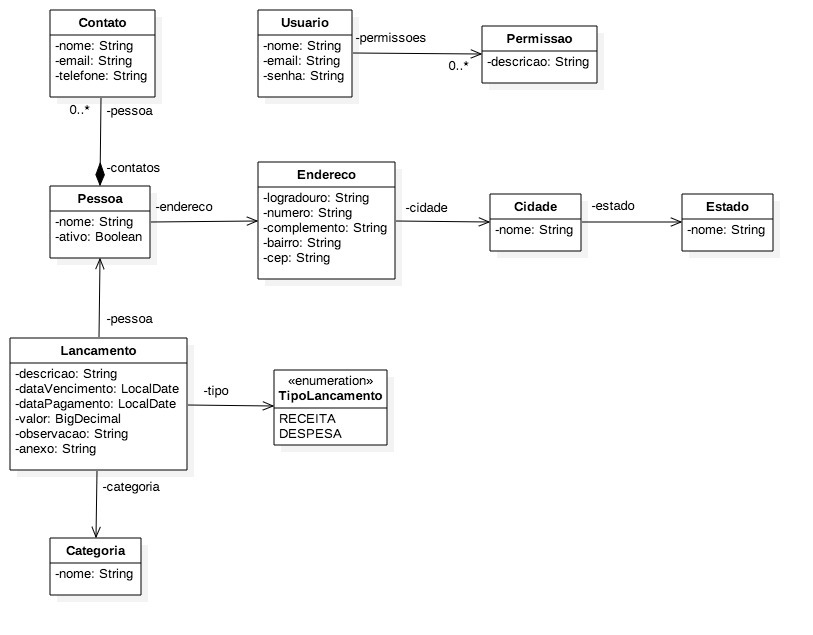

# algamoney-API

Este projeto é uma API [Spring Boot](http://projects.spring.io/spring-boot/) desenvolvida para auxiliar o controle financeiro de uma empresa.

## Diagrama de Classes




## Requisitos da Máquina

Para rodar a aplicação você irá precisar de:

*   [JDK 1.8](http://www.oracle.com/technetwork/java/javase/downloads/jdk8-downloads-2133151.html) - Java™ Platform, Standard Edition Development Kit 
*   [Maven 3](https://maven.apache.org) - Gerenciador de Dependências
* 	[Flyway](https://flywaydb.org/) - Controle de versão do banco de dados
* 	[Spring Boot](https://spring.io/projects/spring-boot) - Framework para facilitar o bootstrapping and desenvolvimento de novas aplicações Spring 
* 	[MySQL](https://www.mysql.com/) - Sistema de Gerenciamento de Banco de Dados Relacional Open-Source 
* 	[git](https://git-scm.com/) - Sistema de Controle de Versão


## Ferramentas Externas Utilizadas

* [Postman](https://www.getpostman.com/) - API Development Environment (Testing Documentation)
* [JasperSoft](https://www.jaspersoft.com/) - Embedded Analytics and Reporting Software (Geração de relatórios em pdf)
* [Thymeleaf](https://www.thymeleaf.org/) - Server-side Java template engine (Template dos e-mails)


## Rodando a Aplicação Localmente

Primeiro renomeie o arquivo `ApplicationExample.properties` em `algamoney-api/src/main/resources/`  para `applicatioin.properties` e preencha-o com os dados necessários correspondentes às configurações da sua máquina. 

Há diversos caminhos para rodar uma aplicação com Spring Boot na sua máquina local. Um deles é executar o método `main` na classe `algamoney-api/src/main/java/com/example/algamoney/api` da sua IDE. Para tal sga os passos abaixo:
1. Faça o Download do zip do projeto ou clone o repositório Git
2. Extraia o conteúdo do zip
3. Abra o Command Prompt e navegue ($cd) até a pasta contendo o pom.xml
4. Abra o eclipse
5. Vá em: File -> Import -> Existing Maven Project -> Navegue até a pasta onde você extraiu o zip
6. Selecione o projeto
7. Choose the Spring Boot Application file (search for @SpringBootApplication)
8. Clique com o direito no arquivo e faça Run as Java Application

Uma alternativa é utilizar o [Spring Boot Maven plugin](https://docs.spring.io/spring-boot/docs/current/reference/html/build-tool-plugins-maven-plugin.html) com o comando:

```shell
mvn spring-boot:run
```

### Segurança

No `pom.xml` podemos observar as dependências necessárias ao bom funcionamento dos requisitos de segurança adequados para o projeto:

```
		<dependency>
		    <groupId>org.springframework.boot</groupId>
		    <artifactId>spring-boot-starter-security</artifactId>
		    <version>2.2.2.RELEASE</version>
		</dependency>
				
		<dependency>
			<groupId>org.springframework.security.oauth</groupId>
			<artifactId>spring-security-oauth2</artifactId>
			<version>2.3.5.RELEASE</version>
		</dependency>
		
		<dependency>
		    <groupId>org.springframework.security</groupId>
		    <artifactId>spring-security-jwt</artifactId>
		    <version>1.0.0.RELEASE</version>
		</dependency>
```


### URLs

|  URL |  Método | Descrição |
|----------|--------------|--------------|
|`http://localhost:8080/pessoas`                                 | GET | Retorna todas as pessoas registradas no banco (com paginação) |
|`http://localhost:8080/pessoas`                                 | POST | Registra uma pessoa |
|`http://localhost:8080/pessoas/10`                              | GET | Retorna o registro de uma pessoa baseada no ID dela |
|`http://localhost:8080/pessoas/10`                              | DELETE | Deleta o registro de uma pessoa baseada no ID dela |
|`http://localhost:8080/pessoas/10`                              | PUT | Atualiza o registro(completo) de uma pessoa baseado no ID dela |
|`http://localhost:8080/pessoas/10`                              | PUT | Atualiza a propriedade ativo de uma pessoa baseada no ID dela |
|`http://localhost:8080/categorias`                              | GET | Retorna todas as categorias |
|`http://localhost:8080/categorias`                              | POST | Registra uma categoria |
|`http://localhost:8080/categorias/10`                           | GET | Retorna uma categoria baseado no ID |
|`http://localhost:8080/lancamentos`                             | POST | Registra uma lançamento |
|`http://localhost:8080/lancamentos`                             | GET  | Retorna todos os lançmentos com paginação |
|`http://localhost:8080/lancamentos/10`                          | GET | Retorna um lançamento baseado no ID |
|`http://localhost:8080/lancamentos/10`                          | DELETE | Deleta um lançamento baseado no ID |
|`http://localhost:8080/lancamentos?resumo&descricao=`           | GET | Retorna resumos de lançamentos(apenas algumas propiedades) baseado na string de pesquisa  |
|`http://localhost:8080/lancamentos/anexo`                       | POST | Registra um anexo de lançamento |
|`http://localhost:8080/lancamentos/estatisticas/por-dia`        | GET | Retorna estatísticas de lançamento baseado em um período de tempo |
|`http://localhost:8080/lancamentos/estatisticas/por-categoria`  | GET | Retorna estatísticas de lançamento baseado em categorias |
|`http://localhost:8080/oauth/token`                             | POST | Solicita Acess Token |
|`http://localhost:8080/oauth/token`                             | POST | Solicita Refresh Token |
|`http://localhost:8080/tokens/revoke`                           | DELETE | Apagar token |
|`http://localhost:8080/relatorios/por-pessoa?inicio=2020-01-01&fim=2020-04-01`                                                  | GET | Retorna um relatório em PDF baseado em um período de tempo  |
|`http://localhost:8080/estados`                                 | GET  | Retorna todos os estados cadastrados no banco |
|`http://localhost:8080/cidades/10`                              | GET | Retorna uma lista de cidades baseada no ID de um estado |
## Arquivos e Diretórios

O projeto tem uma estrutura de diretórios particular. Uma árvore representativa é mostrada a seguir:

```
.
├── algamoney-api
├── src
│   └── main
│       └── java
|            └── com.example.algamoney.api
│                   ├── AlgamoneyApiApplication.java
│                   ├── config
│                   ├── cors
│                   ├── dto
│                   ├── event
│                   ├── exceptionhandler
│                   ├── mail
│                   ├── model
│                   ├── repository
│                   ├── resource
│                   ├── security
│                   ├── service
│                   ├── storage
│                   └── token
├── src
│   └── main
│       └── resources
│           ├── db
│           │     └── migration
│           │         ├── V01__criar_e_registrar_categorias.sql
│           │         ├── V02__criar_tabela_pessoa.sql
│           │         ├── V03__criar_tabela_lancamento.sql
│           │         ├── V04__criar_e_registrar_usuarios_e_permissoes.sql
│           │         └── V05__criar_tabela_contato.sql
│           ├── relatorios
│           │     └── lancamentos-por-pessoa.jasper
│           ├── templates
│           │     └── mail
│           │         └── aviso-lancamentos-vencidos.html
│           ├── application-prod.properties
│           ├── application.properties
│           ├── applicationExample.properties
│           ├── messages.properties
│           └── ValidationMessages.properties
├── src
│   └── test
│       └── java
├── JRE System Library
├── Maven Dependencies
├── src
├── target
│   └──application-0.0.1-SNAPSHOT
├── mvnw
├── mvnw.cmd
├── pom.xml
└── README.md
```

## Pacotes

- `config` — classes de configuração da aplicação
- `cors` — Cross-origin resource sharing/classes para lidar com as permissão/comportamento dos diferentes tipos de requisições e origens
- `dto` — Data Transfer Object/classes que lidam com a comunicação com o banco de dados
- `event` — classes para lidar com a escuta/disparo de comportamentos específicos no sistema
- `exceptionhandler` — classes para lidar com o tratamento de excesões
- `mail` — classes para lidar com o envio de e-mail
- `models` — classes para representar entidades modeladas
- `repository` — classes que lidam com a comunicação com o banco de dados
- `services` — classes para lidar com as regras de negócio
- `storage` — classes para lidar com o armazenamento/recuperação de arquivos junto ao serviço da amazon S3
- `security` — configurações de segurança da aplicação
- `resource` — classes para ouvir/direcionar as requisições doc cliente
- `resources/application.properties` — O Spring lê as propriedades definidas neste arquivo para configurar sua aplicação. Neste arquivo você pode definir a porta padrão do servidor, o context path do servidor, os URLs do banco de dados etc., neste arquivo
- `token` — classes para lidar com o fornecimento/verificação de tokens de segurança
- `pom.xml` - contém todas as dependências do projeto e suas respectivas configurações

## Cliente

Como projeto complementar a este foi desenvolvido uma aplicação cliente com Angular que interage com esta aplicação. Verifique o repósitório [algamoney-ui](https://github.com/AnaKlara/algamoney-ui) no Github.
